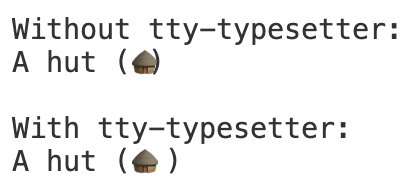
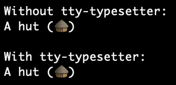

# TTY Typesetter

Terminals have a variety of capabilities when it comes to rendering zero-width
(such as combining) and wide characters (such as Emoji or CJK characters). Often
this doesn't matter - the content will be layed out by the terminal in a
(usually) nice way and the application does not need to worry about it, but it
can become problematic in a few cases:

- The application renders wide characters (such as emoji) which the terminal's
  font supports but the terminal does not. This can lead to the character
  overflowing into the following character, or misalignment of tables.
- The application moves the cursor around to re-write parts of the output as it
  makes progress. If characters have unexpected advance widths or the line has
  wrapped in unexpected ways, this can cause misalignments.
- The application wishes to output a block of text with an indent, including for
  lines which are soft-wrapped.

There are various ways to address these issues, and in particular if `stdin` is
available, it is possible to issue queries to the terminal to get the current
cursor location. However `stdin` is not always available, or may already be in
use for another purpose, so an independent solution is needed.

`tty-typesetter` includes compressed databases of character widths for various
common terminal programs which can be auto-detected from environment variables.
This data can be used directly for more advanced typesetting needs, or can be
used with the bundled basic typesetting capability for easy display of text
while keeping track of the cursor location.

## Usage

```js
import { Typesetter } from 'tty-typesetter';

// can pass in an optional custom environment object (defaults to process.env)
const typesetter = new Typesetter();

const message = 'A hut (\uD83D\uDED6)\n';

process.stdout.write('\n');

process.stdout.write('Without tty-typesetter:\n');
process.stdout.write(message);
process.stdout.write('\n');

process.stdout.write('With tty-typesetter:\n');
for (const line of typesetter.typeset(message)) {
	process.stdout.write(line);
}
process.stdout.write('\n');
```

In VSCode 1.100 (which does not support Unicode 16), this prints:



Whereas in Apple's Terminal.app (which does support Unicode 16), it prints:



## Raw character widths

```js
import { Typesetter } from 'tty-typesetter';

const typesetter = new Typesetter();

w = typesetter.measureCodepoint(0x1f6d6); // 2
w = typesetter.measureCharacter('\uD83D\uDED6'); // 2
w = typesetter.measureString('A hut (\uD83D\uDED6)'); // 10 (or 9 in VSCode 1.100.3)

const ruler = typesetter.measureStringProgressive();
w1 = ruler('A'); // 1
w2 = ruler(0x0020); // 2
w3 = ruler('h'); // 3
w4 = ruler('u'); // 4
w5 = ruler('t'); // 5
```

## Typesetting behaviour

The bundled typesetting will add hard line wraps to maintain a specified column
width. The line wraps are added at spaces, tabs, or optionally soft hyphens.
Wide characters (e.g. emoji and ideographic characters) can also have line wraps
immediately after them. Emoji sequences will not be broken up inside the
sequence unless there is no other option.

Note that this is far from a full implementation of the
[Unicode line breaking algorithm](https://www.unicode.org/reports/tr14/) and
will produce poor results for many scripts.

Each returned line will end in `\r`, `\n`, or (for the last line) may not have a
newline terminator. You can use these to keep track of the line number if you
plan to move the terminal's cursor later:

```js
let line = 1;
for (const line of typesetter.typeset(message)) {
	process.stdout.write(line);
	if (line.endsWith('\n')) {
		line++;
	}
}
```

By default, ANSI escape sequences will be treated as having a width of 0, but
will not otherwise be processed (e.g. cursor movement sequences will not affect
wrapping or tabs).

Most of the behaviour of the typesetter can be customised (the values shown
below are the defaults):

```js
myTypesetter.typeset(message, {
	// add hard line wraps if lines are longer than this
	columnLimit: process.stdout.columns,

	// skip ANSI escape sequences: return a width of 0 for contained characters
	skipAnsi: true,

	// add implicit spaces after emoji which can bleed into the next character if the terminal advances only 1 character
	padUnsupportedCharacters: true,

	// omit soft hyphens from output unless they are at a wrap point
	softHyphens: true,

	// apply a crude line wrapping algorithm based on spaces and soft hyphens
	niceWrap: true,

	// replace tabs with spaces using this tab size (set to -1 to disable)
	tabSize: 8,

	// beginning column for first line, for tab measurements
	beginColumn: 0,

	// beginning column for subsequent lines (defaults to beginColumn)
	wrapColumn: 0,
});
```

For example, if you want to indent every line and keep the tabstops inline with
non-indented tabstops, you can use:

```js
for (const line of typesetter.typeset(message, {
	columnLimit: process.stdout.columns - 2,
	beginColumn: 2,
})) {
	process.stdout.write('  ' + line);
}
```

Alternatively if you just want to indent the lines and allow their tabstops to
be indented with them, you can omit `beginColumn`.

## Supported terminals

This project currently has data for:

- Linux's base terminal
- macOS's Terminal.app (Apple_Terminal)
- VSCode's built-in terminal
- Raspberry Pi OS's LXTerminal
- kitty
- Unicode 16 following the rules originally defined by Markus Kuhn for `wcwidth`
  (used as a fallback if the terminal is not recognised)

## Known limitations

Apple Terminal does not understand emoji sequences, but its font does. This
leads to strange output in some situations. For example
`echo '1\t2\n\U1f9d3\U1f3fd\t2'` will print:

```text
1       2
🧓🏽     2
```

The second line's tab width appears to be 6 instead of 8. This is because the
terminal believes the 2 unicode characters `\U1f9d3` (older adult) and `\U1f3fd`
(skin tone modifier) will be printed separately, occupying 2 cells each. But
when the font actually renders the text, they are combined into a single symbol.

TTY Typesetter does not currently attempt to fix this, but even if/when it does,
this introduces an artificial limit on the line width which cannot be fixed
(because the terminal will soft wrap the line once it believes it is too long,
even if the font can render the line in less space.

Other terminals typically do not support multi-character emoji sequences at all.

## Differences with wcwidth

There is a standard function
[`wcwidth`](https://pubs.opengroup.org/onlinepubs/009604499/functions/wcwidth.html)
which returns the number of cells used by a character, but it often does not
match up with the actual character width used by terminals (and different
terminals use different values). See [the analysis page](analysis/index.html)
for a full list of differences.

The (original) intent of `wcwidth` was that there would be a single copy on each
system and applications would all reference it (specifically discouraging
applications statically linking the function, since this would result in
different versions on the same system). Unfortunately, many terminal programs do
not use `wcwidth` for their character widths, limiting its usefulness. In the
JavaScript world, ports of `wcwidth` are based on hard-coded copies of the
[original version](https://www.cl.cam.ac.uk/~mgk25/ucs/wcwidth.c), which is
especially out-of-date as it was made for Unicode 5.0, meaning they omit the
vast majority of emoji and many ideographic characters which have been added
since then (as well as erroneously returning a width of 2 for some characters
which did not exist at the time but were later added with a width of 1).

## Measuring a new terminal

If you are using a terminal which does not have measurements, or you think the
measurements are incorrect, you can run the measuring script and contribute the
results back to this project:

```sh
npx tty-typesetter
```

Depending on your terminal, this may begin by asking you a question about the
alignment of characters in the display, then it will iterratively print every
Unicode character, then every Unicode emoji sequence, and measure the advance
width of the terminal. Depending on the terminal, this may take a few minutes. A
progress indicator will be displayed for each of the two stages, then the
results will be printed.

The output includes a selection of environment variables which may be used to
identify the terminal, followed by the character width data in a compressed
form. Specifically, the character width data is encoded as a repeating sequence
of 5 alphanumeric characters: a width digit (plus 2; `1` means unsupported and
`0` is unused) followed by the starting codepoint expressed as a 4-digit base-36
value. The emoji sequences are appended on the end as if they were additional
codepoints, ordered in a deterministic way.

If you want to contribute this table to the project, open an
[issue](https://github.com/davidje13/tty-typesetter/issues) with the output
included.
