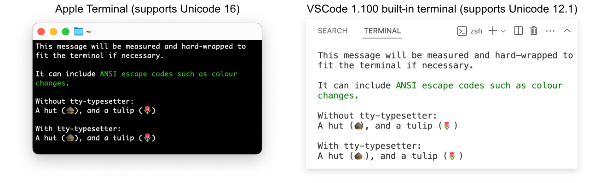

# TTY Typesetter

Terminals have a variety of capabilities when it comes to rendering zero-width
(such as combining) and wide characters (such as Emoji or CJK characters). Often
this doesn't matter — the content will be laid out by the terminal in a
(usually) nice way and the application does not need to worry about it, but it
can become problematic in a few cases:

- The application renders wide characters (such as emoji) which the terminal's
  font supports but the terminal does not. This can lead to the character
  overflowing into the following character, or misalignment of tables.
- The application moves the cursor around to re-write parts of the output as it
  makes progress. If characters have unexpected advance widths or the line has
  wrapped in unexpected ways, this can cause misalignments.
- The application wishes to output a block of text with an indent, including for
  lines which are soft-wrapped, so it needs to apply its own line wrapping.

There are various ways to address these issues, and in particular if `stdin` is
available, it is possible to issue queries to the terminal to get the current
cursor location. However `stdin` is not always available, or may already be in
use for another purpose, so an independent solution is needed.

`tty-typesetter` includes compressed databases of character widths for various
common terminal programs which can be auto-detected from environment variables.
This data can be used directly for more advanced typesetting needs, or can be
used with the bundled basic typesetting capability for easy display of text
while keeping track of the cursor location.

## Usage

```sh
npm install --save tty-typesetter
```

### Typesetting

```js
import { Typesetter } from 'tty-typesetter';

// accepts an optional custom environment object (defaults to process.env)
const ts = new Typesetter();

const message = `This message will be measured and hard-wrapped to fit the terminal if necessary.

It can include \x1b[32mANSI escape codes such as colour changes\x1b[0m.
`;

for (const line of ts.typeset(message)) {
  process.stdout.write(line);
}
```

If you do not need line wrapping but want other typesetting features (such as
normalisation of emoji advance widths), you can use the simpler `typesetLine`
API, which will replace all newlines with spaces and return a single string:

```js
process.stdout.write(ts.typesetLine('My message'));
```

`typesetLine` accepts all the options which `typeset` accepts (see below),
except `columnLimit`, `niceWrap`, and `wrapColumn`.

### Measuring

```js
w = ts.measureCodepoint(0x1f6d6); //              2 (or 1 in VSCode 1.100)
w = ts.measureCharacter('\uD83D\uDED6'); //       2 (or 1 in VSCode 1.100)
w = ts.measureString('A hut (\uD83D\uDED6)'); // 10 (or 9 in VSCode 1.100)
w = ts.measureCodepoint(0x1f); //                null

const ruler = ts.measureStringProgressive();
w1 = ruler('A'); //  1
w2 = ruler(0x20); // 2
w3 = ruler('h'); //  3
w4 = ruler('u'); //  4
w5 = ruler('t'); //  5
w6 = ruler(0x1f); // 5
```

Some terminals (but not many) support grapheme clusters (such as skin tone
modifiers applied to emoji, country flags, or combined emoji like family
groups). These cannot be measured by simply summing individual codepoints, so a
"stateful" API is also available (this is used internally by `typeset`,
`measureString` and `measureStringProgressive`):

```js
const state = ts.makeState({ skipAnsi: true });
w = ts.measureCodepointStateful(0x1f468, state); // 2 (man)
w = ts.measureCodepointStateful(0x200d, state); //  0 (+)
w = ts.measureCodepointStateful(0x1f469, state); // 2 (woman)
w = ts.measureCodepointStateful(0x200d, state); //  0 (+)
w = ts.measureCodepointStateful(0x1f467, state); // -2 (girl)
```

The final character in this example completes a grapheme cluster, causing the
"man" and "woman" emojis to collapse into a single glyph. This means the width
is _reduced_ by adding the extra character, hence the negative value returned.

The `state` is an opaque object holding internal values which should not be
accessed or modified (and may change in future releases). However it has one
property which can be accessed: `uncertainCodepoints` is a count of the number
of codepoints which have been processed which might still be part of a grapheme
cluster, depending on the following characters. This is primarily intended for
line wrapping algorithms so that they can wait for confirmed character widths
before committing to line break positions. It will never be larger than the
longest defined Unicode grapheme cluster (currently 10 codepoints).

On terminals which do not support grapheme clusters, `tty-typesetter` will only
return non-negative numbers even when using `measureCodepointStateful`.

## Typesetting behaviour

The bundled typesetting will add hard line wraps to maintain a specified column
width. The line wraps are added at spaces, tabs, or optionally soft hyphens.
Wide characters (e.g. emoji and ideographic characters) can also have line wraps
immediately after them. Grapheme clusters will not be broken up inside the
cluster unless there is no other option (even in terminals which do not support
rendering them as a single glyph).

Note that this is far from a full implementation of the
[Unicode line breaking algorithm](https://www.unicode.org/reports/tr14/) and
will produce poor results for many scripts (even the full algorithm is noted to
have issues for scripts where word boundaries are implicit).

Each returned line will end in `\r`, `\n`, or (for the last line) may not have a
newline terminator. You can use these to keep track of the line number if you
plan to move the terminal's cursor later:

```js
let line = 1;
for (const line of ts.typeset(message)) {
  process.stdout.write(line);
  if (line.endsWith('\n')) {
    line++;
  }
}
```

By default, ANSI escape sequences will be treated as having a width of 0, but
will not otherwise be processed (e.g. cursor movement sequences will not affect
wrapping or tabs).

Most of the behaviour of the typesetter can be customised (the values shown
below are the defaults):

```js
ts.typeset(message, {
  // add hard line wraps if lines are longer than this
  columnLimit: process.stdout.columns,

  // skip ANSI escape sequences: return a width of 0 for contained characters
  skipAnsi: true,

  // add implicit spaces after emoji which can bleed into the next character if the terminal advances only 1 character
  padUnsupportedCharacters: true,

  // split grapheme clusters if they would cause unexpected behaviour in the terminal
  splitUnsupportedGraphemeClusters: true,

  // omit soft hyphens from output unless they are at a wrap point
  softHyphens: true,

  // apply a crude line wrapping algorithm based on spaces and soft hyphens
  niceWrap: true,

  // avoid wrapping inside grapheme clusters, even if they are not supported by the terminal
  atomicGraphemeClusters: true, // also accepts 'if-supported'

  // replace tabs with spaces using this tab size (set to -1 to disable)
  tabSize: 8,

  // beginning column for first line, for tab measurements
  beginColumn: 0,

  // beginning column for subsequent lines (defaults to beginColumn)
  wrapColumn: 0,

  // see below for an explanation of metadata
  outputMetadata: {},
});
```

For example, if you want to indent every line and keep the tabstops inline with
non-indented tabstops, you can use:

```js
for (const line of ts.typeset(message, {
  beginColumn: 2,
})) {
  process.stdout.write('  ' + line);
}
```

Alternatively if you just want to indent the lines and allow their tabstops to
be indented with them, you can change the `columnLimit` instead:

```js
for (const line of ts.typeset(message, {
  columnLimit: process.stdout.columns - 2,
})) {
  process.stdout.write('  ' + line);
}
```

## `outputMetadata`

When typesetting, it can be useful to know the cursor location. It is possible
to use `measureString` on the lines returned by `typeset`, but this duplicates
work which has already been done by the typesetting algorithm. A more efficient
option is to use the `outputMetadata` to get the cursor location at the end of
each line, and at the end of the whole string:

```js
const metadata = {};
for (const line of ts.typeset(message, { outputMetadata: metadata })) {
  process.stdout.write(line);
  // metadata.column & metadata.linesAdvanced store the cursor location
  // at the end of the current line (excluding any trailing \r or \n)
}
// metadata.column & metadata.linesAdvanced store the cursor location
// at the end of the message (including any trailing \r or \n)
```

If you are using TypeScript, you will need to initialise `metadata` with dummy
values (these will be ignored):

```ts
const metadata = { column: 0, linesAdvanced: 0 };
```

## Supported terminals

This project currently has data for:

- The Linux TTY
- macOS's Terminal.app (Apple_Terminal)
- VSCode's built-in terminal (and dev container terminal)
- JetBrains' editor's built-in terminal (JetBrains-JediTerm)
- VTE-based terminals (Gnome Terminal, LXTerminal, Ptyxis, Xfce Terminal)
- Warp
- kitty
- rxvt-unicode
- xterm
- Emacs ansi-eterm (eterm)
- Unicode 16, following the rules originally defined by Markus Kuhn for
  `wcwidth` (used as a fallback if the terminal is not recognised)

You can find a summary of the behaviours of these terminals
[here](./analysis/summary.md).

## Known limitations

Apple Terminal does not understand grapheme clusters, but its font does. This
leads to strange output in some situations. For example
`echo '1\t2\n\U1f9d3\U1f3fd\t2'` will print:

```text
1       2
🧓🏽     2
```

The second line's tab width appears to be 6 instead of 8. This is because the
terminal believes the 2 unicode characters `\U1f9d3` (older adult) and `\U1f3fd`
(skin tone modifier) will be printed separately, occupying 2 cells each. But
when the font actually renders the text, they are combined into a single glyph.

Fixing the alignment introduces an artificial limit on the line width (because
the terminal will soft wrap the line once it believes it is too long, even if
the font can render the line in less space.

`tty-typesetter` instead takes the approach of intentionally breaking up these
grapheme clusters if the terminal would exhibit this behaviour, making them
behave instead like terminals which do not support grapheme clusters at all.
This can be configured with `splitUnsupportedGraphemeClusters`.

Some terminals fully support grapheme clusters (e.g. kitty), and some support
them via the "Mode 2027" proposal.

## Differences with wcwidth

There is a standard function
[`wcwidth`](https://pubs.opengroup.org/onlinepubs/009604499/functions/wcwidth.html)
which returns the number of cells used by a character, but it often does not
match up with the actual character width used by terminals (and different
terminals use different values). See [the analysis page](analysis/index.html)
for a full list of differences.

The (original) intent of `wcwidth` was that there would be a single copy on each
system and applications would all reference it (specifically discouraging
applications statically linking the function, since this would result in
different versions on the same system). Unfortunately, many terminal programs do
not use `wcwidth` for their character widths, limiting its usefulness. In the
JavaScript world, ports of `wcwidth` are based on hard-coded copies of the
[original version](https://www.cl.cam.ac.uk/~mgk25/ucs/wcwidth.c), which is
especially out-of-date as it was made for Unicode 5.0, meaning they omit the
vast majority of emoji and many ideographic characters which have been added
since then (as well as erroneously returning a width of 2 for some characters
which did not exist at the time but were later added with a width of 1).

As an example: in VSCode 1.100 (which does not support Unicode 16) the "hut"
emoji has an advance width of 1 cell, despite being too wide (and overflowing
into the following cell), whereas in Apple's Terminal.app (which does support
Unicode 16) on the same computer, the same emoji has an advance width of 2
cells. `tty-typesetter` normalises these behaviours:



## Measuring a new terminal

If you are using a terminal which does not have measurements, or you think the
measurements are incorrect, you can run the measuring script and contribute the
results back to this project:

```sh
npx tty-typesetter
```

Depending on your terminal, this may begin by asking you a question about the
alignment of characters in the display, then it will iterratively print every
Unicode character, then every Unicode emoji sequence, and measure the advance
width of the terminal. Depending on the terminal, this may take a few minutes. A
progress indicator will be displayed for each of the two stages, then the
results will be printed.

If the command fails (e.g. gets stuck at 0%), try running it with a smaller
batch size specified (the default is 256; smaller numbers will be slower but are
more likely to be handled by the terminal):

```sh
npx tty-typesetter --batch 8
```

The output includes a selection of environment variables which may be used to
identify the terminal, followed by the character width data in a compressed
form. Specifically, the character width data is encoded as a repeating sequence
of 5 alphanumeric characters: a width digit (plus 2; `1` means unsupported and
`0` is unused) followed by the starting codepoint expressed as a 4-digit base-36
value. The emoji sequences are appended on the end as if they were additional
codepoints, ordered in a deterministic way.

If you want to contribute this table to the project, open an
[issue](https://github.com/davidje13/tty-typesetter/issues) with the output
included.
